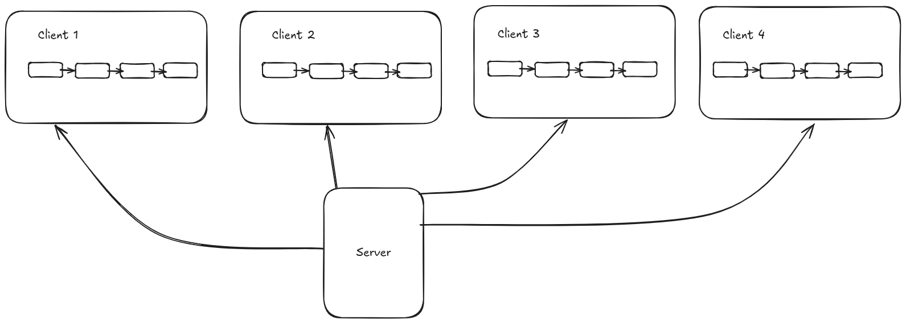

# Dislist
**Dislist** stands for **Distributed list** or **Distributed linked-list** aims to implement a linked-list using one or more remote or local machines this is a small thought experiment of mine. The main problem I am solving here is to implement a *linked-list* under memory constraint and also make my list as long as possible.

This code is not meant to contribution because its too much unreadable and If you want to contribute then let me help you.

`$ git clone https://github.com/ankushT369/dislist.git`

Clone it if you have Rust and gcc installed otherwise you have to setup by yourself.



### Directory Map

```
.
├── Cargo.lock
├── Cargo.toml
├── images
│   └── dislist.png
├── node_manager                (Server side which manages the clients)
│   ├── error_codes.c
│   ├── error_codes.h
│   ├── Makefile
│   ├── node_manager.c
│   └── node_manager.h
├── README.md
└── src                         (Client side which manages the linked-lis)
    ├── client.rs
    ├── main.rs
    ├── parser.rs
    └── utility.rs

3 directories, 13 files

14 text files.
14 unique files.                              
4 files ignored.

-------------------------------------------------------------------------------
Language                     files          blank        comment           code
-------------------------------------------------------------------------------
C                                2             78             37            320
Rust                             4             39             13            207
C/C++ Header                     2             22             33             64
Markdown                         1              8              0             27
make                             1             11             12             18
TOML                             1              2              1              6
-------------------------------------------------------------------------------
SUM:                            11            160             96            642
-------------------------------------------------------------------------------
```
